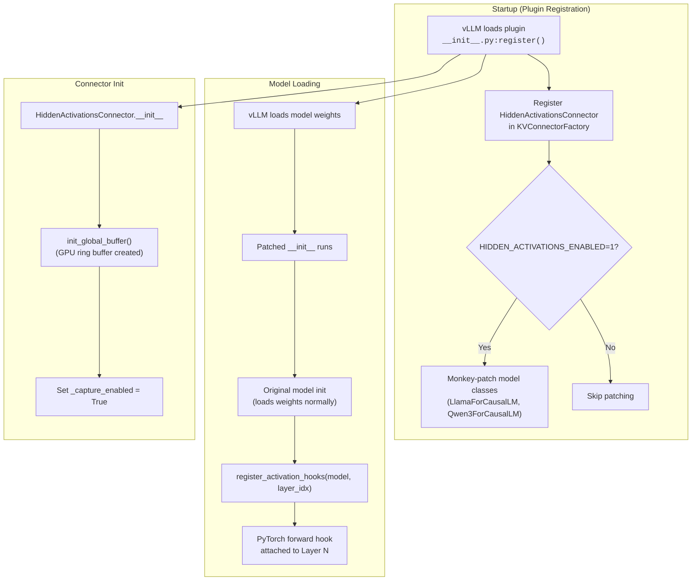
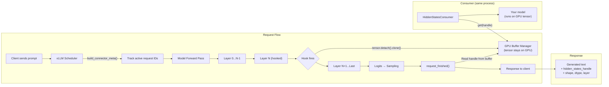

# vllm-hidden-states-extractor

Plugin for extracting hidden states from models served by vLLM.

Provides two approaches for hidden states extraction:

1. **KV Cache Extraction** (Original) — Uses a dummy Eagle3 speculator model to capture hidden states from the KV cache and save to disk.
2. **GPU-Resident Activations** (New) — Uses PyTorch forward hooks to capture actual layer activations, keeping them on GPU with handle-based access (no CPU sync).

## Installation

```bash
uv pip install -e .
# or
pip install -e .
```

> **Note:** vLLM 0.14.0 is a dependency and will be installed automatically.

---

## Approach 1: KV Cache Extraction (Original)


This approach works as follows:

- Creates a dummy Eagle3 model with `eagle_aux_hidden_state_layer_ids` set to the layers to extract hidden states from.
- Existing vLLM plumbing passes those hidden states into the dummy model's forward function.
- The dummy model caches the hidden states into its layers' "KV cache" using fake attention layers.
- A custom KV connector extracts hidden states from the fake attention layers and saves them to disk.

### Usage

1. Serve the model:

```bash
vllm serve ./demo/qwen3_8b \
  --kv-transfer-config '{
    "kv_connector": "ExampleHiddenStatesConnector",
    "kv_role": "kv_producer",
    "kv_connector_extra_config": {"shared_storage_path": "/tmp/hidden_states"}
  }'
```

For model config details, see `demo/qwen3_8b/README.md`.

2. Send a request:

```bash
curl http://localhost:8000/v1/completions \
  -H "Content-Type: application/json" \
  -d '{
    "model": "./demo/qwen3_8b",
    "prompt": "Why are hidden states required for Eagle3 training?"
  }'
```

3. Verify output — hidden states are saved to `/tmp/hidden_states/{request_id}.safetensors` (path returned in `kv_transfer_params`):
   - `hidden_states`: `[num_layers=4, seq_len, hidden_size]`
   - `token_ids`: `[seq_len]`

---

## Approach 2: GPU-Resident Activations (New)

This approach uses PyTorch forward hooks to capture actual layer activations during inference. **Tensors stay on GPU** — no CPU transfer. A buffer handle is returned in the API response for later consumption.

### How it works





### Usage

1. Serve the model with the activation connector (requires `--enforce-eager`):

```bash
HIDDEN_ACTIVATIONS_ENABLED=1 vllm serve Qwen/Qwen3-8B --enforce-eager \
  --kv-transfer-config '{
    "kv_connector": "HiddenActivationsConnector",
    "kv_role": "kv_producer",
    "kv_connector_extra_config": {"activation_layer": 20, "buffer_size": 64, "buffer_ttl": 30}
  }'
```

**Configuration options:**
| Option | Default | Description |
|---|---|---|
| `activation_layer` | `20` | Which transformer layer to capture |
| `buffer_size` | `64` | Max number of tensors kept in GPU buffer |
| `buffer_ttl` | `30.0` | Seconds before unclaimed tensors are freed |

2. Send a request:

```bash
curl http://localhost:8000/v1/completions \
  -H "Content-Type: application/json" \
  -d '{
    "model": "Qwen/Qwen3-8B",
    "prompt": "What is the capital of France?",
    "max_tokens": 50
  }'
```

3. Response includes GPU-resident hidden states info:

```json
{
  "kv_transfer_params": {
    "hidden_states_handle": "d8bc117d-1e3",
    "hidden_states_shape": [7, 4096],
    "hidden_states_dtype": "torch.bfloat16",
    "hidden_states_layer": 20,
    "hidden_states_device": "gpu"
  }
}
```

4. Consume the tensor (from the same process):

```python
from vllm_hidden_states_extractor.consumer import HiddenStatesConsumer

consumer = HiddenStatesConsumer()
tensor, metadata = consumer.get("d8bc117d-1e3")
# tensor is on GPU, shape [7, 4096], bfloat16
output = my_model(tensor)
consumer.free("d8bc117d-1e3")
```

### Real-Time Consumer (Streaming)

To process hidden states **as they are generated** (in a background thread), use the Real-Time Consumer.

1.  Enable it via environment variable:

    ```bash
    export HIDDEN_STATES_REALTIME_CONSUMER=1
    ```

2.  Run the server (same as above):

    ```bash
    HIDDEN_STATES_REALTIME_CONSUMER=1 HIDDEN_ACTIVATIONS_ENABLED=1 vllm serve Qwen/Qwen3-8B --enforce-eager ...
    ```

3.  Customize the logic:
    Edit `src/vllm_hidden_states_extractor/realtime_consumer.py`. The `_polling_loop` function contains a section marked `SECONDARY MODEL LOGIC` where you can inject your code.

    ```python
    # src/vllm_hidden_states_extractor/realtime_consumer.py

    # ... inside the loop ...
    if tensor is not None:
        # YOUR CODE HERE
        # tensor is on GPU, shape [seq_len, hidden_size]
        my_model(tensor)

        # Buffer is freed automatically after this block
    ```

### Supported Models

The activations connector automatically patches these model classes:

- `LlamaForCausalLM` (Llama 3, etc.)
- `Qwen3ForCausalLM` (Qwen3)

### Test Script

```bash
python test_activations.py
python test_activations.py --prompt "Explain gravity" --model meta-llama/Llama-3.1-8B
```

---

## Comparison

| Feature              | KV Cache Extraction    | GPU-Resident Activations        |
| -------------------- | ---------------------- | ------------------------------- |
| Data captured        | KV cache (keys/values) | Layer activations               |
| Storage              | Disk (safetensors)     | GPU buffer (handles)            |
| CPU sync             | Yes (GPU→CPU→disk)     | No                              |
| torch.compile        | Yes                    | No (`--enforce-eager` required) |
| Speculative decoding | Required               | Not needed                      |
| Best for             | Eagle3 training data   | Real-time inference pipelines   |

---

## Demo

To run a multi-client demo with the original approach:

```bash
vllm serve ./demo/qwen3_8b \
  --kv-transfer-config '{
    "kv_connector": "ExampleHiddenStatesConnector",
    "kv_role": "kv_producer",
    "kv_connector_extra_config": {"shared_storage_path": "/tmp/hidden_states"}
  }'

python demo/multi_client_demo.py --num-clients 3 --server-url http://localhost:8000 --model ./demo/qwen3_8b --num-queries 25
```

---

## Project Structure

```
src/vllm_hidden_states_extractor/
├── __init__.py        # Plugin registration (models, connectors, model patching)
├── model.py           # HiddenStatesExtractor dummy model (Approach 1)
├── attention.py       # CacheOnlyAttentionBackend (Approach 1)
├── connector.py       # ExampleHiddenStatesConnector (Approach 1)
├── utils.py           # KV cache reshaping utilities (Approach 1)
├── gpu_buffer.py      # GPU ring buffer with handle-based access (Approach 2)
├── hidden_activations.py # HiddenActivationsConnector + forward hooks (Approach 2)
└── consumer.py        # Client library for reading GPU tensors (Approach 2)
```

The plugin is registered in `pyproject.toml`:

```toml
[project.entry-points."vllm.general_plugins"]
register_hidden_states_extractor = "vllm_hidden_states_extractor:register"
```


